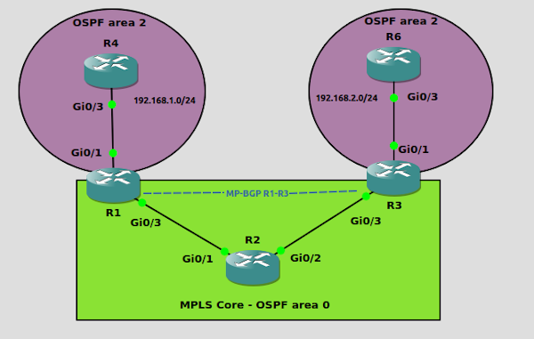
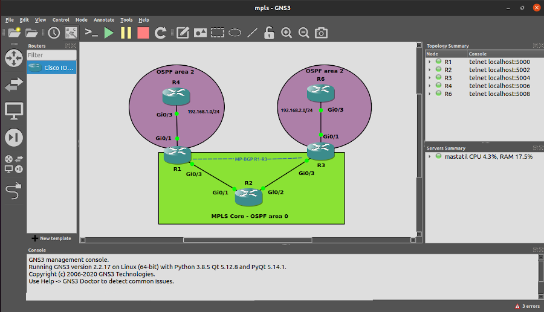
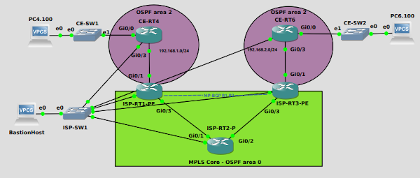

# Indice

- [Ejercicio Core MPLS con GNS3](#ejercicio-core-mpls-con-gns3)
    - [Problemas](#problemas)
    - [Ficheros configuración](#ficheros-configuración)
- [Mejora arquitectura](#mejora-arquitectura)   
- [URLs referencia](#urls-referencia)

***

# Ejercicio Core MPLS con GNS3

El objetivo del ejercicio es que el R4 y R6 se comuniquen entre ellos através de una conexión directa usando una red MPLS.

El core lo componen los tres equipos R1, R2 y R3.

## 1. Activando OSPF en el Core MPLS

En la capa de abajo activaremos OSPF en el area backbone 0 para los equips R1, R2 y R3.

    R1
    ====
    conf t
    hostname R1
    int lo0 
    ip add 1.1.1.1 255.255.255.255
    ip ospf 1 area 0   

    int Gi0/3
    ip add 10.0.0.1 255.255.255.0
    no shut
    ip ospf 1 area 0  
    end

    R2
    ====
    conf t
    hostname R2
    int lo0
    ip add 2.2.2.2 255.255.255.255
    ip ospf 1 are 0 

    int gi0/1
    ip add 10.0.0.2 255.255.255.0
    no shut
    ip ospf 1 area 0

    int gi0/2
    ip add 10.0.1.2 255.255.255.0 
    no shut 
    ip ospf 1 area 0 
    end

    R3
    ====
    conf t
    hostname R3
    int lo0 
    ip add 3.3.3.3 255.255.255.255
    ip ospf 1 are 0 

    int Gi0/3 
    ip add 10.0.1.3 255.255.255.0 
    no shut 
    ip ospf 1 area 0 
    end

Verificaremos que desde R1 llegamos a la loopback de R3.

    R1#ping 3.3.3.3 source lo0

## 2. Activaremos LDP en todas las interfaces del Core MPLS

Activando `mpls ldp autoconfig` en el proceso OSPF, activar el protocolo de distibución de etiquetas ( `LDP`, `Label Distribution Protocol` ) de mpls en cada interface que tenga ospf activado en el este proceso específico.

    R1
    conf t
    router ospf 1
    mpls ldp autoconfig
    end

    R2
    ====
    conf t
    router ospf 1
    mpls ldp autoconfig
    end

    R3
    ====
    conf t
    router ospf 1
    mpls ldp autoconfig
    end

Verificamos que está funcionando LDP.

    R2#show mpls interfaces 
    Interface              IP            Tunnel   BGP Static Operational
    GigabitEthernet0/1     Yes (ldp)     No       No  No     Yes        
    GigabitEthernet0/2     Yes (ldp)     No       No  No     Yes       

    R2#show mpls ldp neighbor 
        Peer LDP Ident: 1.1.1.1:0; Local LDP Ident 2.2.2.2:0
            TCP connection: 1.1.1.1.646 - 2.2.2.2.34514
            State: Oper; Msgs sent/rcvd: 10/10; Downstream
            Up time: 00:02:01
            LDP discovery sources:
              GigabitEthernet0/1, Src IP addr: 10.0.0.1
            Addresses bound to peer LDP Ident:
              10.0.0.1        1.1.1.1         
        Peer LDP Ident: 3.3.3.3:0; Local LDP Ident 2.2.2.2:0
            TCP connection: 3.3.3.3.16972 - 2.2.2.2.646
            State: Oper; Msgs sent/rcvd: 10/10; Downstream
            Up time: 00:01:57
            LDP discovery sources:
              GigabitEthernet0/2, Src IP addr: 10.0.1.3
            Addresses bound to peer LDP Ident:
              10.0.1.3        3.3.3.3      

Y que desde R1 llegamos a la loopback de R3.

    R1#trace 3.3.3.3
    Type escape sequence to abort.
    Tracing the route to 3.3.3.3
    VRF info: (vrf in name/id, vrf out name/id)
      1 10.0.0.2 [MPLS: Label 17 Exp 0] 3 msec 4 msec 2 msec
      2 10.0.1.3 5 msec 3 msec 3 msec
      
## 3. Creamos una conexión MPLS BGP entre R1 y R3       

Estableceremos una sesión Multi Protocol BGP entre R1 y R3 configurando `vpnv4  address family`.

    R1
    ====
    conf t    
    router bgp 1
     neighbor 3.3.3.3 remote-as 1
     neighbor 3.3.3.3 update-source Loopback0
     no auto-summary
     !
     address-family vpnv4
      neighbor 3.3.3.3 activate
    end

    R3
    ====
    conf t
    router bgp 1
     neighbor 1.1.1.1 remote-as 1
     neighbor 1.1.1.1 update-source Loopback0
     no auto-summary
     !
     address-family vpnv4
      neighbor 1.1.1.1 activate
    end

Verificaremos que R1 ve al vecino R3 de forma directa por BGP.

    R1#sh bgp vpnv4 unicast all summary
    BGP router identifier 1.1.1.1, local AS number 1
    BGP table version is 1, main routing table version 1

    Neighbor        V           AS MsgRcvd MsgSent   TblVer  InQ OutQ Up/Down  State/PfxRcd
    3.3.3.3         4            1       5       5        1    0    0 00:00:55        0

## 4. Añadimos dos routers más en un VRF específico

    R4 
    ====
    conf t
    hostname R4
    int lo0
    ip add 4.4.4.4 255.255.255.255 
    ip ospf 2 area 2 
    int gi0/3
    ip add 192.168.1.4 255.255.255.0 
    ip ospf 2 area 2
    no shut 
    end

    R1 
    ====
    conf t
    int gi0/1 
    no shut 
    ip add 192.168.1.1 255.255.255.0   
    end

Creamos el VRF en R1 para la red 192.168.1.0/24.

    R1 
    ====
    conf t
    ip vrf RED 
    rd 4:4
    route-target both 4:4
    end

    R1 
    ====
    conf t
    int gi0/1
    ip vrf forwarding RED
    ! Desconfigura la ip address

    int gi0/1
    ! La volvemos a poner
    ip address 192.168.1.1 255.255.255.0
    end

Miramos la tabla de rutas, pero no vemos la red 192.168.1.0/24 ya que esta el VRF RED.

    R1# show ip route
    ...

    R1#show ip route vrf RED

          192.168.1.0/24 is variably subnetted, 2 subnets, 2 masks
    C        192.168.1.0/24 is directly connected, GigabitEthernet0/1
    L        192.168.1.1/32 is directly connected, GigabitEthernet0/1

Activamos en el R1 el area ospf 2.

    R1
    ====
    conf t
    int gi0/1
     ip ospf 2 area 2    
    end

Ahora ya vemos la loopback de R4 (4.4.4.4) en el R1.

    R1#show ip route vrf RED

          4.0.0.0/32 is subnetted, 1 subnets
    O        4.4.4.4 [110/2] via 192.168.1.4, 00:00:28, GigabitEthernet0/1 <=======
          192.168.1.0/24 is variably subnetted, 2 subnets, 2 masks
    C        192.168.1.0/24 is directly connected, GigabitEthernet0/1
    L        192.168.1.1/32 is directly connected, GigabitEthernet0/1

Pasaremos a configurar el otro extremo, el R6.

    R6    
    ====
    conf t
    hostname R6
    int lo0
    ip add 6.6.6.6 255.255.255.255 
    ip ospf 2 area 2 
    int Gi0/3
    ip add 192.168.2.6 255.255.255.0 
    ip ospf 2 area 2
    no shut 
    end
    
Crearemos el VRF y el area OSPF 2 en el R3 donde conecta R6.

    R3
    ====
    conf t  
    int Gi0/1 
    no shut 
    ip add 192.168.2.1 255.255.255.0     

    ip vrf RED
    rd 4:4
    route-target both 4:4

    int Gi0/1
    ip vrf forwarding RED
    ip address 192.168.2.1 255.255.255.0
    ip ospf 2 area 2
    end

En R3 vemos la red 6.6.6.6 en el VRF RED.

    R3#sh ip route vrf RED

          6.0.0.0/32 is subnetted, 1 subnets
    O        6.6.6.6 [110/2] via 192.168.2.6, 00:00:01, GigabitEthernet0/1
          192.168.2.0/24 is variably subnetted, 2 subnets, 2 masks
    C        192.168.2.0/24 is directly connected, GigabitEthernet0/1
    L        192.168.2.1/32 is directly connected, GigabitEthernet0/1

Realizaremos alguna verificaciones.

    R4#show ip route
          4.0.0.0/32 is subnetted, 1 subnets
    C        4.4.4.4 is directly connected, Loopback0
          192.168.1.0/24 is variably subnetted, 2 subnets, 2 masks
    C        192.168.1.0/24 is directly connected, GigabitEthernet0/3
    L        192.168.1.4/32 is directly connected, GigabitEthernet0/3

    R1#show ip route
          1.0.0.0/32 is subnetted, 1 subnets
    C        1.1.1.1 is directly connected, Loopback0
          2.0.0.0/32 is subnetted, 1 subnets
    O        2.2.2.2 [110/2] via 10.0.0.2, 00:32:28, GigabitEthernet0/3
          3.0.0.0/32 is subnetted, 1 subnets
    O        3.3.3.3 [110/3] via 10.0.0.2, 00:32:18, GigabitEthernet0/3
          10.0.0.0/8 is variably subnetted, 3 subnets, 2 masks
    C        10.0.0.0/24 is directly connected, GigabitEthernet0/3
    L        10.0.0.1/32 is directly connected, GigabitEthernet0/3
    O        10.0.1.0/24 [110/2] via 10.0.0.2, 00:32:18, GigabitEthernet0/3

    R1#sh ip route vrf RED
          4.0.0.0/32 is subnetted, 1 subnets
    O        4.4.4.4 [110/2] via 192.168.1.4, 00:12:10, GigabitEthernet0/1
          192.168.1.0/24 is variably subnetted, 2 subnets, 2 masks
    C        192.168.1.0/24 is directly connected, GigabitEthernet0/1
    L        192.168.1.1/32 is directly connected, GigabitEthernet0/1

Ahora queremos que las redes 192.168.1.0/24 y 192.168.2.0/24 se vean entre ellas via core MPLS.

## 5. Redistribucion OSPF en MP-BGP

    R1
    ====
    conf t
    router bgp 1
    address-family ipv4 vrf RED 
    redistribute ospf 2
    end

    R3
    ====
    conf t
    router bgp 1
    address-family ipv4 vrf RED 
    redistribute ospf 2
    end

    R1#sh ip bgp vpnv4 vrf RED
    BGP table version is 9, local router ID is 1.1.1.1
    ...
         Network          Next Hop            Metric LocPrf Weight Path
    Route Distinguisher: 4:4 (default for vrf RED)
     *>  4.4.4.4/32       192.168.1.4              2         32768 ?
     *>i 6.6.6.6/32       3.3.3.3                  2    100      0 ?
     *>  192.168.1.0      0.0.0.0                  0         32768 ?
     *>i 192.168.2.0      3.3.3.3                  0    100      0 ?
 
    R3#sh ip bgp vpnv4 vrf RED
    BGP table version is 9, local router ID is 3.3.3.3
    ...
         Network          Next Hop            Metric LocPrf Weight Path
    Route Distinguisher: 4:4 (default for vrf RED)
     *>i 4.4.4.4/32       1.1.1.1                  2    100      0 ?
     *>  6.6.6.6/32       192.168.2.6              2         32768 ?
     *>i 192.168.1.0      1.1.1.1                  0    100      0 ?
     *>  192.168.2.0      0.0.0.0                  0         32768 ?

El paso final es el tráfico de vuelta, con lo que distribuimos BGP en OSPF.

    R1
    ====
    conf t
    router ospf 2 
    redistribute bgp 1 subnets 
    end

    R3 
    ====
    conf t
    router ospf 2 
    redistribute bgp 1 subnets
    end

Ahora R4 ve a R6, tanto la loopback de R6 como la red 192.168.2.0/24.

    R4#show ip route
          4.0.0.0/32 is subnetted, 1 subnets
    C        4.4.4.4 is directly connected, Loopback0
          6.0.0.0/32 is subnetted, 1 subnets
    O IA     6.6.6.6 [110/3] via 192.168.1.1, 00:00:28, GigabitEthernet0/3 <=======
          192.168.1.0/24 is variably subnetted, 2 subnets, 2 masks
    C        192.168.1.0/24 is directly connected, GigabitEthernet0/3
    L        192.168.1.4/32 is directly connected, GigabitEthernet0/3
    O IA  192.168.2.0/24 [110/2] via 192.168.1.1, 00:00:28, GigabitEthernet0/3 <=======

Y R6 ve a R4.

    R6#show ip route
          4.0.0.0/32 is subnetted, 1 subnets
    O IA     4.4.4.4 [110/3] via 192.168.2.1, 00:01:19, GigabitEthernet0/3  <=======
          6.0.0.0/32 is subnetted, 1 subnets
    C        6.6.6.6 is directly connected, Loopback0
    O IA  192.168.1.0/24 [110/2] via 192.168.2.1, 00:01:19, GigabitEthernet0/3 <=======
          192.168.2.0/24 is variably subnetted, 2 subnets, 2 masks
    C        192.168.2.0/24 is directly connected, GigabitEthernet0/3
    L        192.168.2.6/32 is directly connected, GigabitEthernet0/3

Con lo que el ping de R4 a R6 funcionará, y pasará de forma directa através de MPLS.

    R4#ping 6.6.6.6
    Type escape sequence to abort.
    Sending 5, 100-byte ICMP Echos to 6.6.6.6, timeout is 2 seconds:
    !!!!!
    Success rate is 100 percent (5/5), round-trip min/avg/max = 2/3/8 ms

    R4#trace 6.6.6.6
    Type escape sequence to abort.
    Tracing the route to 6.6.6.6
    VRF info: (vrf in name/id, vrf out name/id)
      1 192.168.1.1 4 msec 4 msec 3 msec
      2 10.0.0.2 [MPLS: Labels 17/19 Exp 0] 8 msec 5 msec 3 msec
      3 192.168.2.1 [MPLS: Label 19 Exp 0] 3 msec 2 msec 2 msec
      4 192.168.2.6 2 msec 2 msec 2 msec

El proyecto GNS3 del ejercicio queda de la siguiente forma en la GUI de GNS3.

***

# Problemas

- Q: **Error de VRF al aplicar una ospf en una interface con VRF "%VRF specified does not match existing router"**
- A: Borra el router ospf, aplica ospf en el interface y vuelve a crear el router ospf.

        R3(config)#interface GigabitEthernet0/1         
        R3(config-if)#ip ospf 2 area 2
        %VRF specified does not match existing router

        R3(config)#no router ospf 2
        R3(config)#interface GigabitEthernet0/1
        R3(config-if)#ip ospf 2 area 2            
        R3(config-if)#router ospf 2
        R3(config-router)# redistribute bgp 1 subnets
***

# Ficheros configuración

- [R1](./routing-ejercicio-mpls-sobre-gns3-r1.conf)
- [R2](./routing-ejercicio-mpls-sobre-gns3-r2.conf)
- [R3](./routing-ejercicio-mpls-sobre-gns3-r3.conf)
- [R4](./routing-ejercicio-mpls-sobre-gns3-r4.conf)
- [R6](./routing-ejercicio-mpls-sobre-gns3-r6.conf)

***

# Mejora arquitectura

Una ampliación del ejercicio, puede ser añadir un PC en cada red de cliente (CE) con un switch. Y también añadir un bastion host con una red especial para la gestión.

Ejemplo configuracion VRF gestión:

    ip vrf MGMT
     rd 10.125.100.0:0

    interface GigabitEthernet0/2
     description MGMT
     ip vrf forwarding MGMT
     ip address 10.125.100.1X 255.255.255.0
     no shutdown

Si todo esta bien configurado podremos hacer ping al Bastion Host desde los routers.
 
    RX#ping vrf MGMT ip 10.125.100.100
    Type escape sequence to abort.
    Sending 5, 100-byte ICMP Echos to 10.125.100.100, timeout is 2 seconds:
    !!!!!
    Success rate is 100 percent (5/5), round-trip min/avg/max = 1/1/1 ms

Esquema del ejercicio:

- 

***

# URLs referencia
- https://www.rogerperkin.co.uk/ccie/mpls/cisco-mpls-tutorial/
